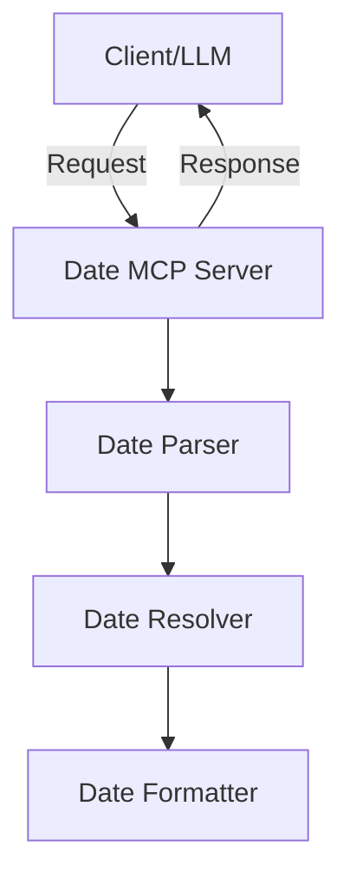

# Date MCP Server Design Doc

## Overview

Date MCP Server は、LLM が日付を正確に認識・処理できるようにするためのサーバーです。
「今日」「昨日」「来週」などの相対的な日付表現を、具体的な日付（YYYY-MM-DD 形式）に変換します。

### Goals

- LLM が日付を正確に認識・処理できるようにする
- 相対的な日付表現を具体的な日付に変換する
- タイムゾーンを考慮した日付処理を提供する

### Non-Goals

- 時刻の処理（HH:mm:ss）は含まない
- 自然言語による日付範囲の処理（「来週の月曜から金曜まで」など）は含まない

## Architecture

### System Components



### Data Flow

1. クライアント/LLM からの日付表現を受信
2. 日付表現をパース
3. 相対日付を解決
4. 標準形式に変換
5. 結果を返却

### API

#### Request

```typescript
interface DateRequest {
  expression: string; // 日付表現（「今日」「明日」など）
  baseDate?: string; // 基準日（省略時は現在時刻）
  timezone?: string; // タイムゾーン（省略時はサーバー設定値）
}
```

#### Response

```typescript
interface DateResponse {
  date: string; // ISO 8601形式の日付
  expression: string; // 元の日付表現
  confidence: number; // 解決の確信度（0-1）
  timezone: string; // 使用されたタイムゾーン
}
```

### Configuration

```typescript
interface ServerConfig {
  timezone: string; // e.g. 'UTC', 'Asia/Tokyo'
}
```

## Implementation

### Directory Structure

```
src/
  date/
    ├── index.ts          # メインエントリーポイント
    ├── parser.ts         # 日付表現のパーサー
    ├── resolver.ts       # 相対日付の解決ロジック
    ├── formatter.ts      # 日付フォーマッター
    ├── constants.ts      # 定数定義
    ├── config.ts         # 設定管理
    └── types.ts          # 型定義
```

### Dependencies

- TypeScript
- date-fns: 日付操作ライブラリ
- date-fns-tz: タイムゾーン対応の日付操作

### Supported Date Expressions

#### 基本的な相対日付

- 「今日」「明日」「昨日」
- 「今週」「来週」「先週」
- 「今月」「来月」「先月」

#### 数値を含む相対表現

- 「X 日前」「X 週間後」
- 「X 月前」「X 月後」

## Configuration

| 環境変数  | 説明                             | 必須 |
| --------- | -------------------------------- | ---- |
| TIME_ZONE | サーバーのデフォルトタイムゾーン | -    |

デフォルト値:

- TIME_ZONE: 'UTC'

## Future Considerations

1. 時刻対応

   - HH:mm:ss 形式のサポート
   - タイムゾーンをまたぐ時刻の処理

2. 日付範囲対応

   - 「来週の月曜から金曜まで」などの範囲指定
   - 繰り返し日付の処理（毎週月曜日など）

3. 自然言語処理の強化
   - より柔軟な日付表現のサポート
   - 曖昧な表現の解決精度向上

## Tasks

### Phase 1: プロジェクトセットアップ

#### 1.1 基本セットアップ

- [ ] プロジェクトディレクトリの作成
- [ ] package.json の初期化
- [ ] TypeScript の設定
  - [ ] tsconfig.json の作成
  - [ ] 必要な TypeScript 設定の追加

#### 1.2 依存関係の追加

- [ ] 必要なパッケージのインストール
  - [ ] TypeScript
  - [ ] date-fns
  - [ ] date-fns-tz
  - [ ] @types/\* の必要な型定義

#### 1.3 プロジェクト構造の作成

- [ ] src/date ディレクトリの作成
- [ ] 各ファイルの作成
  - [ ] types.ts
  - [ ] constants.ts
  - [ ] config.ts
  - [ ] parser.ts
  - [ ] resolver.ts
  - [ ] formatter.ts
  - [ ] index.ts

### Phase 2: 基本実装

#### 2.1 型定義の実装 (types.ts)

- [ ] DateRequest インターフェースの実装
- [ ] DateResponse インターフェースの実装
- [ ] ServerConfig インターフェースの実装
- [ ] その他必要な型の定義

#### 2.2 定数の定義 (constants.ts)

- [ ] デフォルトタイムゾーンの定義
- [ ] 日付表現のマッピング定義
  - [ ] 基本的な相対日付（今日、明日、昨日）
  - [ ] 週に関する表現（今週、来週、先週）
  - [ ] 月に関する表現（今月、来月、先月）

#### 2.3 設定管理の実装 (config.ts)

- [ ] ServerConfig クラスの実装
- [ ] 環境変数からの設定読み込み
- [ ] タイムゾーンのバリデーション

#### 2.4 パーサーの実装 (parser.ts)

- [ ] DateParser クラスの実装
- [ ] 基本的な相対日付のパース
- [ ] 数値を含む相対表現のパース
- [ ] パースエラーハンドリング

#### 2.5 リゾルバーの実装 (resolver.ts)

- [ ] DateResolver クラスの実装
- [ ] 基本的な相対日付の解決
  - [ ] 今日/明日/昨日の解決
  - [ ] 今週/来週/先週の解決
  - [ ] 今月/来月/先月の解決
- [ ] 数値を含む相対表現の解決
  - [ ] X 日前/後の解決
  - [ ] X 週間前/後の解決
  - [ ] X 月前/後の解決
- [ ] タイムゾーンを考慮した日付解決

#### 2.6 フォーマッターの実装 (formatter.ts)

- [ ] DateFormatter クラスの実装
- [ ] ISO 8601 形式への変換
- [ ] タイムゾーン情報の付加

#### 2.7 メインエントリーポイントの実装 (index.ts)

- [ ] DateServer クラスの実装
- [ ] 各コンポーネントの統合
- [ ] エラーハンドリング

### Phase 3: デバッグと最適化

#### 3.1 エラーハンドリング

- [ ] エラーハンドリングの改善
- [ ] エラーメッセージの標準化

#### 3.2 最適化

- [ ] パフォーマンスの最適化
- [ ] メモリ使用量の最適化

#### 3.3 ドキュメント

- [ ] API ドキュメントの作成
- [ ] セットアップガイドの作成
- [ ] 使用例の追加

### Phase 4: リリース準備

#### 4.1 最終チェック

- [ ] コードレビュー
- [ ] セキュリティチェック

#### 4.2 デプロイ準備

- [ ] ビルドスクリプトの作成
- [ ] デプロイドキュメントの作成
- [ ] CI/CD の設定
