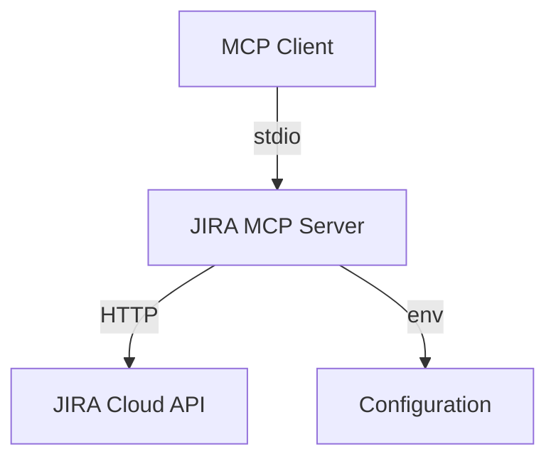
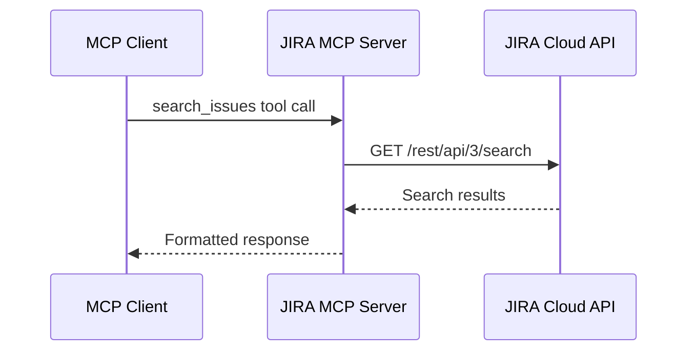
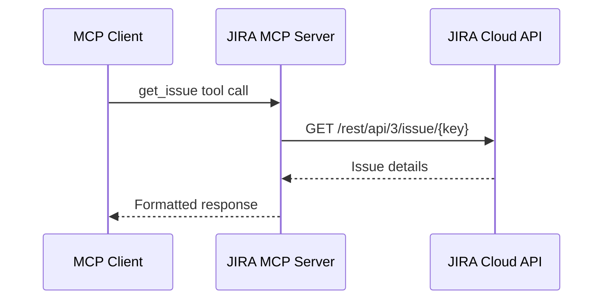

# JIRA MCP Server Design Document

## 概要

JIRA MCP Server は、JIRA Cloud の API を利用して、チケット情報の検索や取得を行うための MCP サーバーです。
Model Context Protocol (MCP) を通じて、JIRA の機能にアクセスすることができます。

## 機能要件

### 必須機能

1. チケット検索

   - JQL (JIRA Query Language) を使用したチケットの検索
   - ページネーションのサポート
   - 取得フィールドの指定

2. チケット詳細取得
   - チケットキーを指定して詳細情報を取得
   - 取得フィールドの指定

## システム設計

### アーキテクチャ



### コンポーネント構成

1. MCP Server Core

   - MCP プロトコルの実装
   - ツールの登録と実行
   - stdio による通信

2. JIRA API Client

   - JIRA Cloud API との通信
   - 認証処理
   - エラーハンドリング

3. Configuration
   - 環境変数の管理
   - バリデーション

### データフロー

1. チケット検索



2. チケット詳細取得



## 実装詳細

### ディレクトリ構造

```
src/jira/
├── README.md
├── package.json
├── tsconfig.json
├── index.ts
├── client.ts
├── config.ts
└── types.ts
```

### 主要コンポーネント

1. `index.ts`

   - MCP Server のメインエントリーポイント
   - ツールの定義と登録
   - サーバーの起動処理

2. `client.ts`

   - JIRA API クライアントの実装
   - API エンドポイントの呼び出し
   - エラーハンドリング

3. `config.ts`

   - 環境変数の定義と検証
   - Zod によるバリデーション

4. `types.ts`
   - TypeScript の型定義
   - API レスポンスの型
   - ツールパラメータの型

## 設定

### 環境変数

| 変数名         | 説明                            | 必須 |
| -------------- | ------------------------------- | ---- |
| JIRA_DOMAIN    | JIRA Cloud のドメイン           | ✓    |
| JIRA_EMAIL     | JIRA アカウントのメールアドレス | ✓    |
| JIRA_API_TOKEN | JIRA API トークン               | ✓    |

## 使用方法

### インストール

```bash
npm install -g @modelcontextprotocol/mcp-server-jira
```

### サーバーの起動

```bash
mcp-server-jira
```

### 利用可能なツール

#### search_issues

JQL を使用してチケットを検索します。

```typescript
interface SearchIssuesParams {
  jql: string;
  startAt?: number;
  maxResults?: number;
  fields?: string[];
}
```

使用例:

```json
{
  "jql": "project = 'MY-PROJECT' AND status = 'In Progress'",
  "maxResults": 10,
  "fields": ["key", "summary", "status"]
}
```

#### get_issue

チケットの詳細情報を取得します。

```typescript
interface GetIssueParams {
  issueKey: string;
  fields?: string[];
}
```

使用例:

```json
{
  "issueKey": "PROJECT-123",
  "fields": ["summary", "description", "status", "assignee"]
}
```

## エラーハンドリング

1. API エラー

   - 400: 不正なリクエスト（JQL 構文エラーなど）
   - 401: 認証エラー
   - 403: 権限エラー
   - 404: リソースが見つからない
   - 429: レート制限超過

2. 設定エラー
   - 環境変数の不足
   - 不正な設定値

## 開発ガイド

### 必要な環境

- Node.js 18 以上
- npm 7 以上

### セットアップ

1. リポジトリのクローン
2. 依存パッケージのインストール
3. 環境変数の設定

### ビルドとテスト

```bash
# ビルド
npm run build

# 開発モードで実行
npm run dev
```

## ライセンス

MIT
