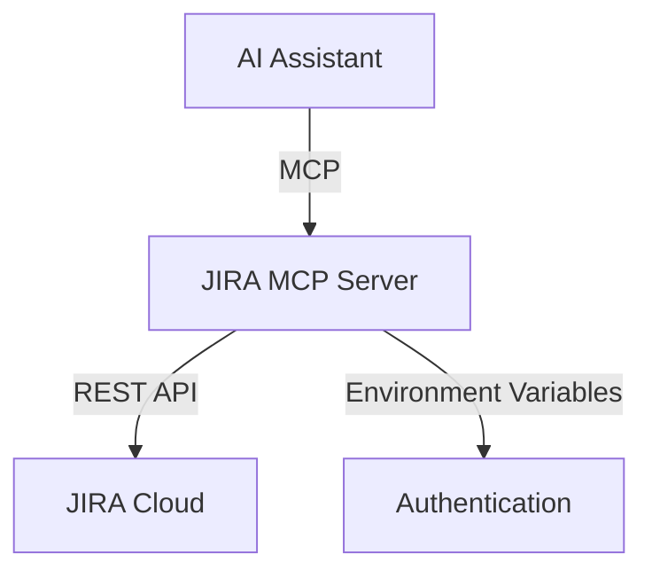

# JIRA MCP Server Design Doc

## Overview

JIRA MCP Server は、JIRA Cloud の REST API を利用して、チケット情報を取得・操作するための MCP Server です。
Model Context Protocol を通じて、JIRA のチケット情報を取得し、AI アシスタントがチケット情報を参照・操作できるようにします。

## Goals

- JIRA Cloud の REST API を利用して、チケット情報を参照する
- Model Context Protocol を通じて、AI アシスタントがチケット情報を参照できるようにする
- セキュアな認証情報の管理を実現する

## Non-Goals

- JIRA Server/Data Center のサポート
- チケットの作成・更新・削除機能
- JIRA の管理者機能のサポート

## Background

JIRA は、多くの開発チームで利用されているプロジェクト管理ツールです。
AI アシスタントが JIRA のチケット情報を参照できるようにすることで、以下のようなユースケースが実現できます：

- チケットの検索と一覧表示
- チケットの詳細情報の参照

## System Architecture

### High Level Design



### Components

#### MCP Server

- Model Context Protocol を実装したサーバー
- JIRA API クライアントを利用してチケット情報を取得・操作
- 環境変数から認証情報を取得

#### JIRA API Client

- JIRA Cloud REST API を呼び出すクライアント
- API トークンを利用した認証
- エラーハンドリングとレート制限の管理

### Data Model

```typescript
// Core Types
interface JiraIssue {
  id: string;
  key: string;
  fields: {
    summary: string;
    description: string;
    status: {
      name: string;
      id: string;
    };
    assignee?: {
      displayName: string;
      accountId: string;
    };
    priority: {
      name: string;
      id: string;
    };
    created: string;
    updated: string;
  };
}

interface JiraSearchResponse {
  issues: JiraIssue[];
  total: number;
  maxResults: number;
  startAt: number;
}

// MCP Tool Parameters
interface SearchIssuesParams {
  jql: string;
  startAt?: number;
  maxResults?: number;
}

interface GetIssueParams {
  issueKey: string;
}
```

## API Design

### MCP Tools

1. `search_issues`

   - Description: JQL を利用してチケットを検索
   - Parameters:
     - jql: string (必須) - JQL クエリ文字列
     - startAt: number (オプション) - 検索開始位置
     - maxResults: number (オプション) - 取得する最大件数

2. `get_issue`

   - Description: チケットの詳細情報を取得
   - Parameters:
     - issueKey: string (必須) - JIRA チケットキー

## Security Considerations

### Authentication

- JIRA Cloud の API トークンを利用
- 環境変数で認証情報を管理
  - `JIRA_HOST`: JIRA Cloud のホスト URL
  - `JIRA_API_TOKEN`: API トークン
  - `JIRA_USER_EMAIL`: API トークンに紐づくユーザーのメールアドレス

### Security Best Practices

- 認証情報は環境変数でのみ管理し、ソースコード内には記載しない
- API トークンの権限は必要最小限に設定
- エラーメッセージには詳細な認証情報を含めない

## Testing Strategy

### Unit Tests

#### Config Module Tests

- 環境変数の存在チェック
- 環境変数の型チェック
- 無効な設定値のバリデーション

#### API Client Tests

- 認証ヘッダーの生成
- API エンドポイントの構築
- レスポンスのパース
- エラーハンドリング
- レート制限の処理

#### MCP Tools Tests

- パラメータバリデーション
- JQL クエリの構築
- レスポンスフォーマット
- エラーレスポンス

### Integration Tests

#### Search Issues

- 有効な JQL での検索
- 無効な JQL でのエラー
- ページネーションの動作
- 検索結果の型チェック

#### Get Issue

- 存在するチケットの取得
- 存在しないチケットのエラー
- レスポンスフィールドの検証

#### Error Scenarios

- 認証エラー
- ネットワークエラー
- レート制限エラー
- タイムアウト

## Deployment

### Requirements

- Node.js 18.x 以上
- TypeScript 5.x
- 環境変数の設定
  - `JIRA_HOST`
  - `JIRA_API_TOKEN`
  - `JIRA_USER_EMAIL`

### Installation

```bash
cd src/jira
npm install @modelcontextprotocol/sdk
npm install @types/node zod
```

### Configuration

```typescript
// config.ts
export const config = {
  host: process.env.JIRA_HOST,
  apiToken: process.env.JIRA_API_TOKEN,
  userEmail: process.env.JIRA_USER_EMAIL,
};
```

## Future Considerations

- カスタムフィールドのサポート
- バッチ処理のサポート
- キャッシュ機能の追加
- レート制限の最適化

## Implementation Tasks

### 1. プロジェクト初期設定 (Estimated: 1 hour)

1.1. プロジェクトディレクトリの作成

- [ ] `src/jira` ディレクトリの作成
- [ ] `.gitignore` の設定
- [ ] `src/jira/.env.example` の作成

  1.2. 依存関係の設定

- [ ] `src/jira/package.json` の作成
- [ ] 必要なパッケージのインストール

  - `@modelcontextprotocol/sdk`
  - `@types/node`
  - `zod`
  - `typescript`
  - `dotenv`

    1.3. TypeScript の設定

- [ ] `tsconfig.json` の作成と設定
- [ ] `src` ディレクトリ構造の作成

### 2. 設定モジュールの実装 (Estimated: 1-2 hours)

2.1. 型定義の実装

- [ ] `src/jira/types.ts` の作成
- [ ] JIRA の型定義の実装
- [ ] MCP Tool のパラメータ型定義の実装

  2.2. 設定モジュールの実装

- [ ] `src/jira/config.ts` の作成
- [ ] 環境変数の型定義の実装
- [ ] 設定値の検証処理の実装

### 3. JIRA API クライアントの実装 (Estimated: 2-3 hours)

3.1. API クライアントの基本実装

- [ ] `src/jira/client.ts` の作成
- [ ] API クライアントクラスの実装
- [ ] 認証処理の実装

  3.2. API メソッドの実装

- [ ] チケット検索メソッドの実装
- [ ] チケット詳細取得メソッドの実装
- [ ] エラーハンドリングの実装

### 4. MCP Server の実装 (Estimated: 2-3 hours)

4.1. サーバーの基本実装

- [ ] `src/jira/index.ts` の作成
- [ ] MCP Server インスタンスの作成
- [ ] 基本的なエラーハンドリングの実装

  4.2. MCP Tools の実装

- [ ] `search_issues` ツールの実装
- [ ] `get_issue` ツールの実装
- [ ] レスポンスフォーマットの実装

### 5. ドキュメントの作成 (Estimated: 1 hour)

5.1. README の作成

- [ ] インストール手順の記載
- [ ] 設定手順の記載
- [ ] 使用例の記載

  5.2. API ドキュメントの作成

- [ ] MCP Tools の使用方法の記載
- [ ] パラメータの説明
- [ ] レスポンスの説明

## References

- [JIRA Cloud REST API Documentation](https://developer.atlassian.com/cloud/jira/platform/rest/v3/intro/)
- [Model Context Protocol Documentation](https://github.com/modelprompt/model-context-protocol)
