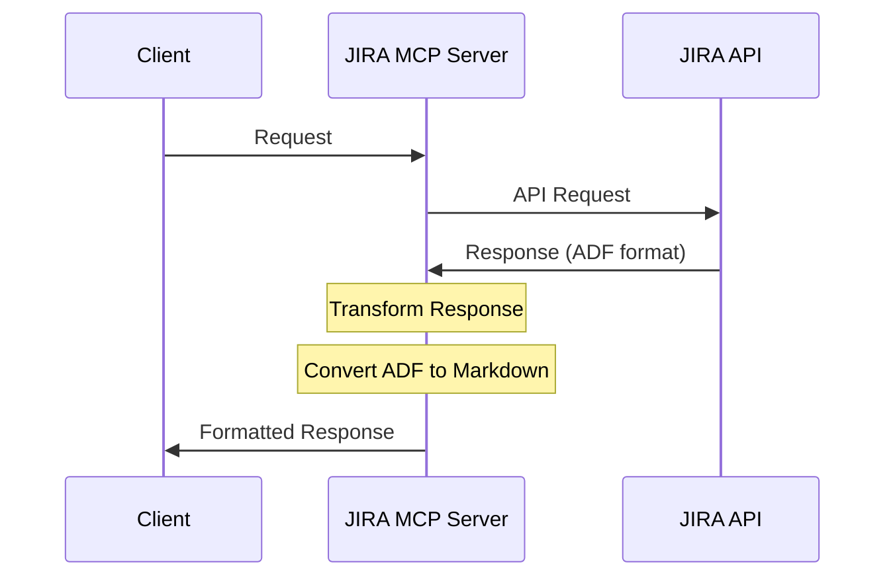

# Design Document: JIRA MCP Server Response Format Improvement

## Overview

JIRA MCP サーバーのレスポンス形式を改善し、より使いやすい形式に整形する実装を行います。

### Goals

- JIRA API レスポンスの構造を維持しつつ、必要なフィールドのみを含める
- Description フィールドを ADF から Markdown 形式に変換
- 一貫性のあるレスポンス形式の提供

### Non-Goals

- JIRA API の機能拡張
- 新しいエンドポイントの追加
- パフォーマンスの最適化

## Technical Design

### System Architecture

現在の構成を維持しつつ、レスポンス形式の変換処理を追加します。



### Data Structures

#### 1. Response Interface

```typescript
interface JiraMcpResponse {
  content: Array<{
    type: "text";
    text: string; // Stringified JSON
  }>;
}

interface JiraApiResponse {
  expand: string;
  startAt: number;
  maxResults: number;
  total: number;
  issues: JiraIssue[];
}

interface JiraIssue {
  expand: string;
  id: string;
  self: string;
  key: string;
  fields: {
    labels: string[];
    assignee: JiraUser | null;
    reporter: JiraUser;
    progress: {
      progress: number;
      total: number;
    };
    issuetype: {
      id: string;
      name: string;
    };
    project: {
      id: string;
      key: string;
      name: string;
    };
    updated: string;
    customfield_10015: string; // start date
    duedate: string;
    summary: string;
    description: string; // Converted to Markdown
    status: {
      name: string;
      id: string;
    };
    creator: JiraUser;
    created: string;
    fixVersions: Array<{
      id: string;
      name: string;
      archived: boolean;
      released: boolean;
      releaseDate: string;
    }>;
  };
}
```

### Core Components

#### 1. ADF to Markdown Converter

```typescript
class ADFConverter {
  private static processNode(node: ADFNode): string;
  private static processContent(content: ADFNode[]): string;
  private static convertTable(node: ADFTableNode): string;
  private static convertText(node: ADFTextNode): string;

  public static convert(doc: ADFDocument): string;
}
```

#### 2. Response Formatter

```typescript
class ResponseFormatter {
  private static formatIssue(issue: JiraIssue): FormattedIssue;
  private static formatFields(fields: JiraIssueFields): FormattedFields;

  public static format(response: JiraApiResponse): JiraMcpResponse;
}
```

### Implementation Details

#### 1. ADF to Markdown 変換ルール

| ADF Element | Markdown Format      |
| ----------- | -------------------- |
| heading     | `#` × level + text   |
| paragraph   | text + `\n\n`        |
| text        | plain text           |
| strong      | `**text**`           |
| em          | `*text*`             |
| table       | `\|` separated cells |
| list        | `- ` or `1. `        |

#### 2. エラーハンドリング

```typescript
try {
  const response = await client.searchIssues(params);
  const formattedResponse = ResponseFormatter.format(response);
  return {
    content: [
      {
        type: "text",
        text: JSON.stringify(formattedResponse, null, 2),
      },
    ],
  };
} catch (error) {
  return {
    isError: true,
    content: [
      {
        type: "text",
        text: error instanceof Error ? error.message : "Unknown error occurred",
      },
    ],
  };
}
```

## Implementation Tasks

### Phase 1: 基本設定と型定義

1. プロジェクト構造の整理

   - [ ] src/jira/types/ ディレクトリの作成
   - [ ] src/jira/utils/ ディレクトリの作成
   - [ ] src/jira/formatters/ ディレクトリの作成

2. 型定義の実装
   - [ ] types/jira-response.ts の作成
     - JiraMcpResponse インターフェース
     - JiraApiResponse インターフェース
   - [ ] types/jira-issue.ts の作成
     - JiraIssue インターフェース
     - JiraUser インターフェース
   - [ ] types/adf.ts の作成
     - ADFDocument 型
     - ADFNode 型
     - その他 ADF 関連の型定義

### Phase 2: ADF to Markdown コンバーター実装

1. 基本構造の実装

   - [ ] utils/adf-converter.ts の作成
   - [ ] ADFConverter クラスの基本構造実装
   - [ ] processNode メソッドのスケルトン実装

2. 基本要素の変換実装

   - [ ] テキスト変換の実装
   - [ ] 段落変換の実装
   - [ ] 見出し変換の実装
   - [ ] 強調（bold, italic）変換の実装

3. 複雑な要素の変換実装

   - [ ] テーブル変換の実装
   - [ ] リスト変換の実装
   - [ ] リンク変換の実装
   - [ ] コード変換の実装

4. エッジケース対応
   - [ ] null/undefined チェックの実装
   - [ ] ネストされた要素の処理実装
   - [ ] 未知の要素タイプのフォールバック実装

### Phase 3: レスポンスフォーマッター実装

1. 基本構造の実装

   - [ ] formatters/response-formatter.ts の作成
   - [ ] ResponseFormatter クラスの基本構造実装

2. フォーマッターメソッドの実装

   - [ ] formatIssue メソッドの実装
   - [ ] formatFields メソッドの実装
   - [ ] format メソッドの実装

3. エラーハンドリングの実装
   - [ ] try-catch ブロックの実装
   - [ ] エラーメッセージのフォーマット実装
   - [ ] エラーレスポンスの型定義

### Phase 4: MCP Server 統合

1. サーバー更新

   - [ ] index.ts の更新
   - [ ] 新しいフォーマッターの統合
   - [ ] エラーハンドリングの統合

2. search_issues ツールの更新

   - [ ] レスポンスフォーマッターの統合
   - [ ] エラーハンドリングの統合
   - [ ] パラメータバリデーションの更新

3. get_issue ツールの更新
   - [ ] レスポンスフォーマッターの統合
   - [ ] エラーハンドリングの統合
   - [ ] パラメータバリデーションの更新

### Phase 5: 最終調整とドキュメント

1. コードクリーンアップ

   - [ ] 未使用コードの削除
   - [ ] コードスタイルの統一
   - [ ] コメントの追加と更新

2. ドキュメント更新

   - [ ] README.md の更新
   - [ ] API ドキュメントの更新
   - [ ] 変換ルールドキュメントの作成

3. 最終確認
   - [ ] 全ての機能の動作確認
   - [ ] エラーケースの確認
   - [ ] パフォーマンスの確認
